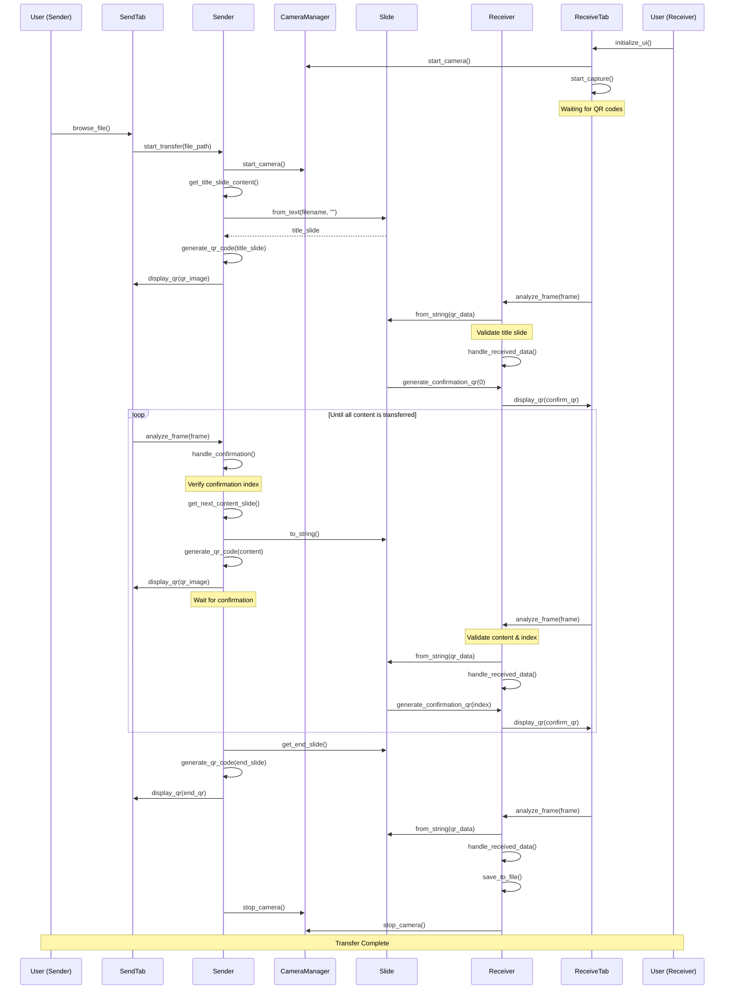

# LightLink

LightLink is a Python-based project enabling data transfer between two computers using QR codes. The project features a simple user interface for sending and receiving files, utilizing cameras and screens for communication.

---

## **Project Overview**
LightLink showcases the use of QR codes for innovative data transfer. By breaking down text files into smaller chunks and encoding them into QR codes, the project demonstrates how visual communication can bypass traditional network protocols.

---

## **Features**
- **Send and Receive Files**: Transfer text files between devices via QR codes.
- **Simple UI**: Easy-to-use interface for both sender and receiver.
- **Real-time Operation**: Processes frames in real-time to ensure smooth communication.

---

## **Technologies Used**
- **Python**: Core programming language.
- **Tkinter**: For creating the user interface.
- **OpenCV**: For handling camera input and QR code detection.

---

## **Project Structure**
```
LightLink/
├── src/
│   ├── main.py         # Main application file
│   ├── sender.py       # Back-end logic for the sender
│   ├── receiver.py     # Back-end logic for the receiver
│   ├── slide.py        # Handles chunking data into QR codes
├── README.md           # Project documentation
├── LICENSE             # Project license
├── requirements.txt    # Python dependencies
```

---

## **Installation**
1. Clone the repository:
   ```bash
   git clone https://github.com/your-username/LightLink.git
   cd LightLink
   ```
2. Install dependencies:
   ```bash
   pip install -r requirements.txt
   ```
3. Run the application:
   ```bash
   python src/main.py
   ```

---

## **Usage**
1. Launch the application.
2. Select the "Send" tab to start sending files:
   - Upload a text file.
   - The application will split the file into chunks and display QR codes sequentially.
3. Select the "Receive" tab to start receiving files:
   - Use the camera to scan QR codes.
   - The application will reconstruct the file from the scanned codes.

---

## **Example**
Below is an example of how QR codes are used to transfer files:


---

## **Sequence Diagram**
The following diagram illustrates the workflow between the sender and receiver:


---

## **License**
This project is licensed under the MIT License - see the [LICENSE](LICENSE) file for details.

---

## **Contributing**
Contributions are welcome! Feel free to submit a pull request or open an issue.

---

## **Acknowledgments**
Special thanks to the developers and contributors who made this project possible.
