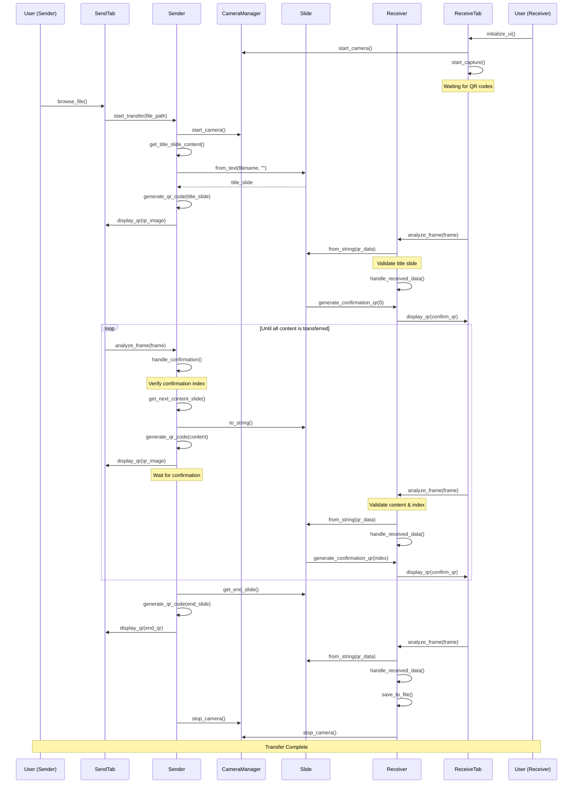

# LightLink

[]()
[]()

Transfer files between computers using QR codes - no internet or cables required! LightLink transforms your data into a sequence of QR codes displayed on one screen and captured by another device's camera, enabling seamless file transfer without traditional connectivity methods.


## System Requirements
- Python 3.12 (developed and tested with this version)
- IDE: Tested on JetBrains PyCharm
- Hardware Requirements:
  - Webcam
  - Display screen
  - Operating System: Windows (currently tested only on Windows)

## Important Notes
- Ensure no other applications are using the camera while running LightLink
- Camera access permissions may be required on first run

---

## **Project Overview**
LightLink showcases the use of QR codes for innovative data transfer. By breaking down text files into smaller chunks and encoding them into QR codes, the project demonstrates how visual communication can bypass traditional network protocols.

---

## **Features**
- **Send and Receive Files**: Transfer text files between devices via QR codes.
- **Simple UI**: Easy-to-use interface for both sender and receiver.
- **Real-time Operation**: Processes frames in real-time to ensure smooth communication.

---

## **Technologies Used**
- **Python**: Core programming language.
- **Tkinter**: For creating the user interface.
- **OpenCV**: For handling camera input and QR code detection.

---

## How It Works

### Data Transfer Protocol
LightLink uses a simple yet robust protocol for transferring data through QR codes. Each QR code represents one of four types of frames:

#### Frame Types and Structure
1. **Title Frame (T)**
   - Format: `Tfilename`
   - Length: 39 characters
   - Example: `Tsend_file.txt`
   - Always has index 0
   - Contains the name of the file being transferred

2. **Content Frame (D)**
   - Format: `Dindex|content`
   - Length: 39 characters total
     - Index: 1 character
     - Content: 38 characters
   - Example: `D1abcdefghij0123456789abcdefghij01234567`
   - Sequential index starting from 1

3. **Confirmation Frame (C)**
   - Format: `Cindex`
   - Length: 2 characters
   - Example: `C0`
   - Sent by receiver to confirm successful frame reception

4. **End Frame (E)**
   - Format: `EX`
   - Length: 2 characters
   - Marks the end of transmission

### Frame Sequencing
- Frame indexing starts at 0 (Title frame)
- Content frames use sequential numbers (1,2,3...)
- Each frame maintains a fixed length for reliable transmission

  ---

## **Project Structure**
```
LightLink/
├── src/
│   ├── main.py         # Main application file
│   ├── sender.py       # Back-end logic for the sender
│   ├── receiver.py     # Back-end logic for the receiver
│   ├── slide.py        # Handles chunking data into QR codes
├── assets/
│   ├── qr_example1.png # Example QR code
│   ├── qr_example2.png # Example QR code
├── docs/
│   ├── sequence_diagram.png # Sequence diagram
├── README.md           # Project documentation
├── LICENSE             # Project license
├── requirements.txt    # Python dependencies
```

---

## **Installation**
1. Clone the repository:
   ```bash
   git clone https://github.com/your-username/LightLink.git
   cd LightLink
   ```
2. Install dependencies:
   ```bash
   pip install -r requirements.txt
   ```
3. Run the application:
   ```bash
   python src/main.py
   ```

---

## **Usage**
1. Launch the application.
2. Select the "Send" tab to start sending files:
   - Upload a text file.
   - The application will split the file into chunks and display QR codes sequentially.
3. Select the "Receive" tab to start receiving files:
   - Use the camera to scan QR codes.
   - The application will reconstruct the file from the scanned codes.

---

## **Example**
Below is an example of how QR codes are used to transfer files:


---

## **Sequence Diagram**
The following diagram illustrates the workflow between the sender and receiver:


---

## **License**
This project is licensed under the MIT License - see the [LICENSE](LICENSE) file for details.

---

## **Contributing**
Contributions are welcome! Feel free to submit a pull request or open an issue.

---

## **Acknowledgments**
Special thanks to the developers and contributors who made this project possible.
